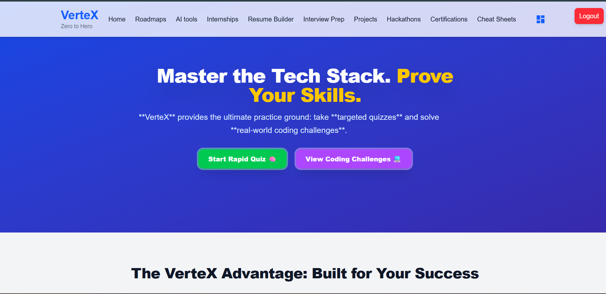

<!-- AIGNITE Banner (centered) -->

  <h1> Vertex AI – An AI Powered bridge from learning to opportunity. </h1>
  
<strong>Powered by MLSC | AIGNITE 2K25</strong>

---

  <strong>🚀 Vertex AI</strong> 
  <em>An all-in-one AI-powered platform helping students learn, practice, and grow from zero to career-ready heroes.</em>

---

## 📖 Project Description

✨ **Problem Statement:**  
Students struggle to connect classroom learning with real-world skills, certifications, and job opportunities. Current platforms are fragmented and fail to provide a single ecosystem for learning, internships, and professional growth.

💡 **Proposed Solution:**  
**Vertex AI** bridges the gap by providing an AI-driven student career acceleration ecosystem — offering curated learning paths, resume tools, certifications, projects, hackathons, and internships — all within one integrated platform.

🎯 **Target Users / Use Cases:**  
- College students seeking structured learning and internships.  
- Universities aiming to boost placement readiness.  
- Recruiters looking for verified, skill-tested candidates.

---

## 🔬 Methodology

1. **Research & Ideation** – Identified key pain points of student career development.  
2. **Design** – Created an intuitive UI/UX for seamless navigation.  
3. **Develop** – Built modules integrating Vertex AI for automation and recommendations.  
4. **Test** – Collected student feedback on usability and AI accuracy.  
5. **Deploy** – Hosted web app demo using Firebase and Vertex AI endpoints.  
6. **Future Scope** – Personalized mentorship, AI-generated roadmaps, and campus integrations.

---

## 🧠 Core Features

1. **Roadmaps & Learning Paths**  
   - Curated roadmaps for AI/ML, Web Dev, Cybersecurity, etc.  
   - Step-by-step learning from beginner to advanced.  

2. **Cheat Sheets & Quick Guides**  
   - Concise, exam-ready notes for fast revision and interview prep.

3. **Certifications**  
   - AI-powered certificate generation and LinkedIn integration.

4. **Resume Builder (Career Craft)**  
   - Vertex AI generates descriptions for skills, projects, and achievements.  
   - One-click export to portfolio.

5. **Internships & Jobs**  
   - Smart AI-matched internships based on skill profile and domain.  

6. **Interview Preparation**  
   - AI-powered mock interviews and coding challenges.

7. **Hackathons & Competitions**  
   - Aggregates ongoing hackathons across campuses.  

8. **Projects & Portfolio Builder**  
   - Builds live portfolio websites automatically from user resumes.  

9. **Cheat Codes for Career Growth**  
   - Productivity tips, AI assistants for academics, and LinkedIn optimization.  

---

## 👥 Team Details
**Team Name:** `Vertex AI`

| Name | Role | Email |
|---|---:|---|
| U. Deepak | Team Lead | deepakuppala8@gmail.com.com |
| S. Ranjith | Backend Developer | siddamranjith52447@gmail.com |
| V.S. Rishi Charan | Frontend Developer | rishicharanvanam250@gmail.com |
| S. Pranay | ML Engineer | s.pranayy07@gmail.com |

---

## 🛠️ Technology Stack
`React.js` | `Node.js` | `Firebase` | `Python` | `Vertex AI` | `TensorFlow`

---

## 📹 Demonstration Video
▶️ [https://drive.google.com/file/d/1UNAr4hvGqAGdIzfq6wOyfCSMB3A5Rg7-/view?usp=sharing](#)

---

## 🌐 Deployment
🔗 [https://vertex-app-chi.vercel.app/](#)

---

## 📚 References
- Google Vertex AI Docs  
- Firebase ML Integration  
- OpenAI API Documentation  
- TensorFlow Tutorials  

---

## 🖼️ Assets / Screenshots

   
  

---

  <b>Hackathon:</b> AIGNITE 2K25 | Organized by MLSC 

